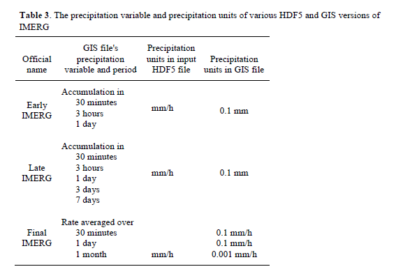

# Data Cube Ingestion Guide

This document will guide users through the process of indexing and ingesting ARD datasets into the Data Cube using the command line tool and required configuration files. This document contains information and snippets from the [official ODC user guide](http://datacube-core.readthedocs.io/en/latest/user/intro.html). This document describes the process for indexing and ingesting any arbitrary raster dataset, from Landsat to real time GPM data.

# Contents

- [Introduction](#introduction)
- [Prerequisites](#prerequisites)
- [Product Definitions](#product_definition)
- [Generating Metadata](#generating_metadata)
- [Indexing Datasets](#indexing_datasets)
- [Ingesting Datasets](#ingesting_datasets)
- [Brief Overview of Processes](#overview)
- [Next Steps](#next_steps)
- [Common problems/FAQs](#faqs)

# []() Introduction

The indexing and ingestion workflow is required to add data to the Data Cube and provide access to the data via a Python API. Data is loaded by querying the Data Cube for data that matches certain metadata attributes, such as measurement name, product and platform type, geospatial and temporal extents.

**Read the official ODC documentation on [their readthedocs.io page](http://datacube-core.readthedocs.io/en/stable/ops/config.html)**

The ingestion workflow consists of: Creating a product definition for your new dataset, creating a preparation script for your new dataset, generating a .yaml metadata file using the preparation script, indexing the dataset's metadata in the Data cube, and running the ingestion process on indexed datasets. A brief description of these steps can be found below:

- **Creating and adding a product definition**: Product definitions include a name, description, basic metadata, and a list of measurements with relevant properties in the dataset.
- **Creating a preparation script and generating metadata**: Dataset metadata is a .yaml file that describes a dataset is required for indexing in the Data Cube. This metadata file will include properties such as measurements with paths to the data, platform and sensor names, geospatial extents and projection, and acquisition dates. This is done using a Python preparation script that pulls the required fields from file names, dataset xml metadata, and raster datasets.
- **Indexing dataset metadata**: Indexing a dataset involves recording the content of the metadata file in the database. This allows access to the metadata via the Python API and for programmatic loading of data based on metadata.
- **Ingesting indexed datasets**: The ingestion process defines a mapping between a source dataset and a dataset with more desirable properties. A new product definition will be added to the Data Cube with the properties defined in the ingestion configuration file and datasets that match the provided criteria will be modified according to the new product definition and written to disk in the new format. Each modified dataset (or dataset tile) is indexed in the Data Cube.

# []() Ingestion Cheat Sheet

The first step is to add your product definition. This will be done _once_ for each dataset type - e.g. If we are indexing all GPM data over our country and continue to collect data after the initial download, this is done a _single_ time. There is only one product definition for each dataset type.

```
datacube -v product add ~/Datacube/agdc-v2/ingest/dataset_types/gpm/gpm_imgerg_gis.yaml
```

Now, for each dataset that is collected you will need to run a preparation script that generates the correct metadata as well as the 'datacube' command that indexes the dataset in the database. This only needs to be done once _for each dataset_ - if you collect a new scene, you'll need to do this process for only that scene. Please note that indexing the dataset in the database creates an absolute reference to the path on disk - you cannot move the dataset on disk after indexing or it won't be found and will create problems.

```
python ~/Datacube/agdc-v2/ingest/prepare_scripts/gpm/gpm_imgerg_gis_prepare.py /datacube/original_data/gpm/3B-MO-GIS.MS.MRG.3IMERG.20140301-S000000-E235959.03.V04A
datacube -v dataset add /datacube/original_data/gpm/3B-MO-GIS.MS.MRG.3IMERG.20140301-S000000-E235959.03.V04A/*.yaml
```

Now that the datasets have the correct metadata generated and have been indexed, we can run the ingestion process. Ingestion skips all datasets that have already been ingested, so this is a single command.

```
datacube -v ingest -c ~/Datacube/agdc-v2/ingest/ingestion_configs/gpm/gpm_monthly_global.yaml --executor multiproc 2
```

After an initial ingestion, when you download new acquisitions all you need to do is generate the metadata, index the dataset, and run the ingestion process.

# []() Prerequisites

To index and ingest data into the Data Cube, the following prerequisites must be met:

- The full Data Cube Installation Guide must have been followed and completed. This includes:

  - You have a local user that is used to run the Data Cube commands/applications
  - You have a database user that is used to connect to your 'datacube' database
  - The Data Cube is installed and you have successfully run 'datacube system init'
  - All code is checked out and you have a virtual environment in the correct directories: `~/Datacube/{data_cube_ui, data_cube_notebooks, datacube_env, agdc-v2}`

- A georeferenced raster dataset. This can come in the form of:

  - A series of GeoTiff files for each band
  - A NetCDF/HDF5 file containing multiple bands
  - A BEAM-DIMAP formatted dataset (.dim with .img)
  - Other widely supported raster datasets

- Associated metadata for your dataset (XML, file naming details, etc). This includes (at the very least, more is always better):

  - Acquisition date
  - Processing level
  - Product type

- Your product's associated datasheet. This should describe your bands, datatypes, flag definitions, nodata values, etc. For example, the Landsat 7 datasheet can be found [here](https://landsat.usgs.gov/sites/default/files/documents/ledaps_product_guide.pdf), GPM datasheet [here](https://pps.gsfc.nasa.gov/Documents/README.GIS.pdf). If you do not have access to a datasheet, a lot of the datatype information can be found using 'gdalinfo'. The main objective here is to identify the datatype of each band and the nodata value for each band.

If you have not yet completed our Data Cube Installation Guide, please do so before continuing.

The only _required_ metadata for the default 'eo' metadata (found [here](https://github.com/opendatacube/datacube-core/blob/develop/datacube/index/default-metadata-types.yaml) in the search fields) are platform, instrument, product type, lat, lon, and time.

For this example, we will be using a GPM Monthly dataset, found [here](http://ec2-52-201-154-0.compute-1.amazonaws.com/datacube/original_data/gpm/3B-MO-GIS.MS.MRG.3IMERG.20140301-S000000-E235959.03.V04A.zip). Accompanying this dataset is the associated product datasheet, found [here](http://ec2-52-201-154-0.compute-1.amazonaws.com/datacube/original_data/gpm/README.GIS.pdf). Please download these two files before continuing.

# []() Creating and adding a product definition

Product definitions define the attributes for entire datasets and are stored as .yaml files. These attributes include:

- A short name for the dataset
- A short description of what the dataset is
- A metadata type - more on this later
- Product metadata, including platform, instrument, product type, etc.
- Any number of measurements that are associated with the dataset and their attributes.

A full template of the dataset type can be found at the bottom of this section.

**Read the official ODC documentation on product definitions on [their readthedocs.io page](http://datacube-core.readthedocs.io/en/stable/ops/config.html)**

The first steps are giving your dataset a descriptive name, a description listing the type of data/preprocessing/projection, and a metadata type. The metadata type can be customized by advanced users, but for simplicity we will use the default EO metadata type.

```
name: gpm_imerg_gis_monthly
description: GIS translation of the imerg data product. Multi satellite, global, precipitation estimate. Downloaded from ftp://arthurhou.pps.eosdis.nasa.gov/gpmdata/. Rate measured over one month.
metadata_type: eo
```

The name is a short name for the dataset - we generally stick with an all lower case, underscore separated string. This is the name that will be used to access datasets of this type programmatically and during ingestion. 'eo' is the default metadata_type, and the description is completely user defined.

The metadata type refers to another .yaml schema and describes what metadata will be collected during the [Generating Metadata](#generating_metadata) section. You can create your own metadata type if custom fields or metadata sets are desired, but we will stick with the default metadata type for this example.

The metadata type schema can be found [here](https://github.com/opendatacube/datacube-core/blob/develop/datacube/model/schema/metadata-type-schema.yaml), with the default metadata type ('eo') being found [here](https://github.com/opendatacube/datacube-core/blob/develop/datacube/index/default-metadata-types.yaml). You can see in the default metadata type that the name is 'eo', corresponding to our dataset type. Additionally, you'll see that the dataset field in that file includes an id, creation date, measurements, etc. These fields correspond with what needs to be generated in the next step and the structure of the .yaml/.json file - for now, just note that each product definition must be associated with a metadata type.

An optional element, 'storage', can be included as well. This can be seen in the [dataset type schema](https://github.com/opendatacube/datacube-core/blob/develop/datacube/model/schema/dataset-type-schema.yaml) - This can be included to describe the format of the data on disk, including the CRS, resolution, and driver. These are used in the ingestion process to specify projection/tiling/file type, but for now it is completely optional. This option is _only_ applicable if your dataset has a constant resolution and projection. For example, Landsat data uses UTM based projections (inconsistent dataset projection), while GPM data is consistently in WGS84 projection with a 0.1 degree resolution. The latitude element is generally negative assuming the reference point is the upper left corner.

```
storage:
    crs: EPSG:4326
    resolution:
        longitude: 0.10
        latitude: -0.10
```

Next in the file is the metadata field:

```
metadata:
  format: {name: GeoTiff}
  instrument: {name: GPM}
  platform: {code: GPM}
  product_type: monthly
```

The metadata as defined by the product definition schema [here](https://github.com/opendatacube/datacube-core/blob/develop/datacube/model/schema/dataset-type-schema.yaml) is an object - any number of fields and any schemas can be put here, as long as they are defined in the metadata type definition. If you open the [default metadata type file](https://github.com/opendatacube/datacube-core/blob/develop/datacube/index/default-metadata-types.yaml), you'll see that the format is expected to be nested in format -> name, the product type is just in product type, etc. This is described using an 'offset' from the document root. This metadata is used to 'match' datasets to their appropriate product type, so the script in the next section that generates the metadata files must produce the same platform and product type as what is listed above.

The last element (or list of elements) in the product definition is the measurement, seen below.

```
measurements:
- name: total_precipitation
  units: '0.001 mm/h'
  dtype: uint16
  nodata: 9999

- name: liquid_precipitation
  units: '0.001 mm/h'
  dtype: uint16
  nodata: 9999

- name: ice_precipitation
  units: '0.001 mm/h'
  dtype: uint16
  nodata: 9999

- name: percent_liquid
  units: 'percent'
  dtype: uint8
  nodata: 255
```

The full measurement schema with all possible formats can be found in the [dataset type schema](https://github.com/opendatacube/datacube-core/blob/develop/datacube/model/schema/dataset-type-schema.yaml). The only properties that are required are **name, dtype, nodata, and units**. There should be one measurement entry for each expected band in the dataset.

This information is found in the product datasheet, linked above. The list of measurements, units, and nodata values can all be found in the datasheet. Some snippets of this information can be found below.





Gdalinfo can be used to get dtype values.


A template for a dataset type can be found below:

```
name: { dataset type name }
description: { dataset description }
metadata_type: eo

metadata:
    platform:
        code: { Platform code }
    instrument:
        name: { Instrument name }
    product_type: { Product type }
    format:
        name: { File type format }

storage:
    crs: { CRS of the dataset, if constant }
    resolution:
        longitude: { Resolution in the x direction }
        latitude: { Resolution in the y direction - usually negative }

measurements:
    - name: { Band name }
      aliases: [{ List of aliases for this band }]
      dtype: { Dataset datatype }
      nodata: { Nodata value for the dataset - from datasheet }
      units: { Band units - string }

      { Any number of measurements }

    - name: { Band name }
      aliases: [{ List of aliases for this band }]
      dtype: { Dataset datatype }
      nodata: { Nodata value for the dataset - from datasheet }
      units: 'bit_index'
      flags_definition:
        { Flag name }:
          bits: [{ List of integers - what bits are valid }]
          description: { Flag description }
          values:
            1: { String description of bit }
            2: { String description of bit }
            4: { String description of bit }
            8: { String description of bit }
            16: { String description of bit }
            32: { String description of bit }
            64: { String description of bit }
            128: { String description of bit }
```

Once your product definition has all required information, you add it to the Data Cube. For our GPM example, this is done with the following command:

```
datacube -v product add ~/Datacube/agdc-v2/ingest/dataset_types/gpm/gpm_imerge_gis.yaml
```

This command should be run from within the virtual environment. This will validate your product definition and, if valid, will index it in the Data Cube. The expected output should look like below:

```
2017-04-19 11:23:39,861 21121 datacube INFO Running datacube command: /home/localuser/Datacube/datacube_env/bin/datacube -v product add ~/Datacube/agdc-v2/ingest/dataset_types/gpm/gpm_imerge_gis.yaml
2017-04-19 11:23:40,184 21121 datacube.index.postgres._dynamic INFO Creating index: .....
2017-04-19 11:23:40,194 21121 datacube.index.postgres._dynamic INFO Creating index: .....
Added "gpm_imerge_gis_monthly"
```

The 'Added \*' statement should read that it has added the name defined within the product definition.

If you open pgAdmin3 and examine the data in the dataset_type table, you'll see that there is now a row for the added product with all associated metadata. With the product definition added to the Data Cube, the next step is generating the required metadata to add a dataset.

# []() Generating Metadata

Before starting this step, you'll need to make sure that you have your dataset downloaded and stored locally on disk.

Decompress your dataset into its own directory. If the naming is important ensure that the decompressed data is placed in an aptly named directory. For Landsat, we get the path/row/date information from the file path, so we decompress the data into directories with the same name as the archive.

You can extract the GPM dataset using the unzip command:

```
unzip -d 3B-MO-GIS.MS.MRG.3IMERG.20140301-S000000-E235959.03.V04A 3B-MO-GIS.MS.MRG.3IMERG.20140301-S000000-E235959.03.V04A.zip
```

Now that we have the data extracted into a named directory, we can generate the required metadata .yaml file. This is done with Python scripts found in `~/Datacube/agdc-v2/ingest/prepare_scripts/*`. There are a variety of scripts provided, including USGS Landsat, Sentinel 1, and ALOS.

**Read the official ODC documentation on dataset definitions on [their readthedocs.io page](http://datacube-core.readthedocs.io/en/stable/ops/config.html)**

These scripts are responsible for creating a .yaml metadata file that contains all required metadata fields. The required and available metadata fields are defined in the metadata type definition that is associated with the product definition. In the previous section, we added a product definition with a metadata type of 'eo', the default metadata type. We can view the default metadata types at [this url](https://github.com/opendatacube/datacube-core/blob/develop/datacube/index/default-metadata-types.yaml). In this file, you'll see the properties that the preparation scripts need to produce and the structure of the file. The fields in the 'search_fields' section list the fields that can be used to query the Data Cube for data while the fields not in that section are just general metadata. For instance:

> The 'id' field is listed as "id: ['id']", so the id metadata field will be found in the metadata .yaml file in the root of the document

> The 'measurements' field is described in comments as a dict with certain attributes with an offset of ['image', 'bands'], so the measurements will be a dictionary keyed by measurement name found in the document as image: bands: {key: val, ...}

> platform, product type, lat, and lon are all search fields, so the user will be able to select storage units based on these attributes with the API.

Each of the fields defined in the metadata type reference should be filled in the dataset metadata .yaml file. Please note that only the 'search fields' are required, but there should be as much metadata collected as possible. We are also able to add metadata to the document that is not listed in the metadata type, everything will be stored in the database.

Your script should produce a file that has all the fields in the below example:

```
creation_dt: '2014-03-01 00:00:00'
extent:
  center_dt: '2014-03-01 11:59:59'
  coord:
    ll: {lat: -90.0000031, lon: -179.99999689999999}
    lr: {lat: -90.0000031, lon: 180.0000031}
    ul: {lat: 89.9999969, lon: -179.99999689999999}
    ur: {lat: 89.9999969, lon: 180.0000031}
  from_dt: '2014-03-01 00:00:00'
  to_dt: '2014-03-01 23:59:59'
format: {name: GeoTiff}
grid_spatial:
  projection:
    geo_ref_points:
      ll: {x: -179.9999969, y: -90.0000031}
      lr: {x: 180.0000031, y: -90.0000031}
      ul: {x: -179.9999969, y: 89.9999969}
      ur: {x: 180.0000031, y: 89.9999969}
    spatial_reference: GEOGCS["WGS 84",DATUM["WGS_1984",SPHEROID["WGS 84",6378137,298.257223563,AUTHORITY["EPSG","7030"]],AUTHORITY["EPSG","6326"]],PRIMEM["Greenwich",0,AUTHORITY["EPSG","8901"]],UNIT["degree",0.01745329251994328,AUTHORITY["EPSG","9122"]],AUTHORITY["EPSG","4326"]]
id: e95ed0b5-ac2b-4c59-9aa8-2b3f0cd2ef40
image:
  bands:
    ice_precipitation: {path: 3B-MO-GIS.MS.MRG.3IMERG.20140301-S000000-E235959.03.V04A.ice.tif}
    liquid_precipitation: {path: 3B-MO-GIS.MS.MRG.3IMERG.20140301-S000000-E235959.03.V04A.liquid.tif}
    percent_liquid: {path: 3B-MO-GIS.MS.MRG.3IMERG.20140301-S000000-E235959.03.V04A.liquidPercent.tif}
    total_precipitation: {path: 3B-MO-GIS.MS.MRG.3IMERG.20140301-S000000-E235959.03.V04A.tif}
instrument: {name: GPM}
lineage:
  source_datasets: {}
platform: {code: GPM}
processing_level: V04A
product_type: monthly
```

The easiest way to generate one of these scripts is to use an existing script as a base. There are three main components in generating this metadata: Parsing attributes from file names, parsing data from included metadata (XML or otherwise, potentially not necessary), and getting CRS/projection attributes from one of the dataset files.

A script that will produce the metadata above is copied below:

```
# coding=utf-8
"""
Ingest data from the command-line.
"""
from __future__ import absolute_import, division

import logging
import uuid
from xml.etree import ElementTree
import re
from pathlib import Path
import yaml
from dateutil import parser
from datetime import timedelta
import datetime
import rasterio.warp
import click
from osgeo import osr
import os
# image boundary imports
import rasterio
from rasterio.errors import RasterioIOError
import rasterio.features
import shapely.affinity
import shapely.geometry
import shapely.ops


def band_name(path):
    str_path = str(path)
    if '.ice.tif' in str_path:
        return 'ice_precipitation'
    if '.liquid.tif' in str_path:
        return 'liquid_precipitation'
    if '.liquidPercent.tif' in str_path:
        return 'percent_liquid'
    return 'total_precipitation'


def get_product_type_from_code(code):
    product_type = {'DAY': 'daily', 'MO': 'monthly', 'HHR': 'hourly'}
    return product_type[code]


def get_projection(path):
    with rasterio.open(str(path)) as img:
        left, bottom, right, top = img.bounds
        return {
            'spatial_reference':
            'GEOGCS["WGS 84",DATUM["WGS_1984",SPHEROID["WGS 84",6378137,298.257223563,AUTHORITY["EPSG","7030"]],AUTHORITY["EPSG","6326"]],PRIMEM["Greenwich",0,AUTHORITY["EPSG","8901"]],UNIT["degree",0.01745329251994328,AUTHORITY["EPSG","9122"]],AUTHORITY["EPSG","4326"]]',
            'geo_ref_points': {
                'ul': {
                    'x': left,
                    'y': top
                },
                'ur': {
                    'x': right,
                    'y': top
                },
                'll': {
                    'x': left,
                    'y': bottom
                },
                'lr': {
                    'x': right,
                    'y': bottom
                },
            }
        }


def get_coords(geo_ref_points, spatial_ref):
    spatial_ref = osr.SpatialReference(spatial_ref)
    t = osr.CoordinateTransformation(spatial_ref, spatial_ref.CloneGeogCS())

    def transform(p):
        lon, lat, z = t.TransformPoint(p['x'], p['y'])
        return {'lon': lon, 'lat': lat}

    return {key: transform(p) for key, p in geo_ref_points.items()}


def populate_coord(doc):
    proj = doc['grid_spatial']['projection']
    doc['extent']['coord'] = get_coords(proj['geo_ref_points'], proj['spatial_reference'])


def prep_dataset(fields, path):
    images = {band_name(im_path): {'path': str(im_path.relative_to(path))} for im_path in path.glob('*.tif')}
    projdict = get_projection(path / next(iter(images.values()))['path'])
    doc = {
        'id': str(uuid.uuid4()),
        'processing_level': fields["processing_level"],
        'product_type': fields["product_type"],
        'creation_dt': fields["start_time"].strftime("%Y-%m-%d %H:%M:%S"),
        'platform': {
            'code': "GPM"
        },
        'instrument': {
            'name': "GPM"
        },
        'extent': {
            'from_dt':
            fields["start_time"].strftime("%Y-%m-%d %H:%M:%S"),
            'to_dt':
            fields["end_time"].strftime("%Y-%m-%d %H:%M:%S"),
            'center_dt':
            (fields["start_time"] + (fields["end_time"] - fields["start_time"]) / 2).strftime("%Y-%m-%d %H:%M:%S")
        },
        'format': {
            'name': 'GeoTiff'
        },
        'grid_spatial': {
            'projection': projdict
        },
        'image': {
            'bands': images
        },
        'lineage': {
            'source_datasets': {}
        }
    }
    populate_coord(doc)
    return doc


def prepare_datasets(gpm_path):
    underscore_replacement = Path(str(gpm_path).replace('.', '_'))
    fields = re.match(("3B-"
                       r"(?P<duration>HHR|DAY|MO)"
                       "-GIS_MS_MRG_3IMERG_"
                       r"(?P<product_year>[0-9]{4})"
                       r"(?P<product_month>[0-9]{2})"
                       r"(?P<product_day>[0-9]{2})"
                       "-S"
                       r"(?P<start_hour>[0-9]{2})"
                       r"(?P<start_minute>[0-9]{2})"
                       r"(?P<start_second>[0-9]{2})"
                       "-E"
                       r"(?P<end_hour>[0-9]{2})"
                       r"(?P<end_minute>[0-9]{2})"
                       r"(?P<end_second>[0-9]{2})"
                       "_"
                       r"(?P<sequence_indicator>(?<=_).*?(?=_))"
                       "_"
                       r"(?P<version>\w{4})"), underscore_replacement.stem).groupdict()
    fields.update({
        'processing_level':
        fields['version'],
        'product_type':
        get_product_type_from_code(fields['duration']),
        'start_time':
        datetime.datetime(
            int(fields['product_year']),
            int(fields['product_month']),
            int(fields['product_day']),
            int(fields['start_hour']), int(fields['start_minute']), int(fields['start_second'])),
        'end_time':
        datetime.datetime(
            int(fields['product_year']),
            int(fields['product_month']),
            int(fields['product_day']), int(fields['end_hour']), int(fields['end_minute']), int(fields['end_second']))
    })
    gpm = prep_dataset(fields, gpm_path)
    return (gpm, gpm_path)


@click.command(help="Prepare GPM IMERG GIS products for ingestion into the Data Cube.")
@click.argument('datasets', type=click.Path(exists=True, readable=True, writable=True), nargs=-1)
def main(datasets):
    logging.basicConfig(format='%(asctime)s %(levelname)s %(message)s', level=logging.INFO)

    for dataset in datasets:

        path = Path(dataset)

        logging.info("Processing %s", path)
        documents = prepare_datasets(path)

        dataset, folder = documents
        yaml_path = str(folder.joinpath('datacube-metadata.yaml'))
        logging.info("Writing %s", yaml_path)
        with open(yaml_path, 'w') as stream:
            yaml.dump(dataset, stream)


if __name__ == "__main__":
    main()

```

The function `prep_dataset` uses Regex to parse attributes from the file name. Here, we're pulling the duration (Month), year/month/date, start time, and end time. These fields are then passed into `prep_dataset` for further metadata additions.

`prep_dataset` then generates the list of images using `band_name` and pairs it to a path relative to the root data directory. The projection details are generated using `get_projection`; this involves opening the .tif files using rasterio and getting bounding box data as well as geo reference points. The final document is the dumped to a yaml file.

```
2017-06-09 18:24:18,821 INFO Processing /datacube/original_data/gpm/3B-MO-GIS.MS.MRG.3IMERG.20140301-S000000-E235959.03.V04A
2017-06-09 18:27:27,356 INFO Writing /datacube/original_data/gpm/3B-MO-GIS.MS.MRG.3IMERG.20140301-S000000-E235959.03.V04A/datacube-metadata.yaml
```

You'll see that the script has created a .yaml file titled datacube-metadata.yaml in the same directory as your data files. Open this .yaml file and verify that all fields have been populated and there are no errors.

# []() Indexing Datasets

## Indexing Datasets in the Database

Now that you have a product definition added and a datacube-metadata.yaml file generated for your scene, it is now time to index the dataset and associate it with the product definition. This is done with a datacube command from the CLI. Please note that indexing the dataset in the database creates an absolute reference to the path on disk - you cannot move the dataset on disk after indexing or it won't be found and will create problems.

Run the `datacube dataset add` command on the directory or metadata .yaml file generated for the dataset. This command will load the .yaml metadata file and create a Dataset class object from the contents. It will then try to match the dataset to a product definition using the provided metadata.

```
#ensure that you are doing this from within the virtual environment. If not, activate it with 'source ~/Datacube/datacube_env/bin/activate'
datacube -v dataset add /datacube/original_data/gpm/3B-MO-GIS.MS.MRG.3IMERG.20140301-S000000-E235959.03.V04A
#or
#datacube -v dataset add /datacube/original_data/gpm/3B-MO-GIS.MS.MRG.3IMERG.20140301-S000000-E235959.03.V04A/datacube-metadata.yaml
```

The resulting console output will resemble the output below:

```
2017-06-09 18:32:32,075 5086 datacube INFO Running datacube command: /home/localuser/Datacube/datacube_env/bin/datacube -v dataset add /datacube/original_data/gpm/3B-MO-GIS.MS.MRG.3IMERG.20140301-S000000-E235959.03.V04A/datacube-metadata.yaml
Indexing datasets  [####################################]  100%2017-06-09 18:32:32,122 5086 datacube-dataset INFO Matched Dataset <id=18163152-7388-4607-a75b-1f20e7b70045 type=gpm_imerg_gis_monthly location=/datacube/original_data/gpm/3B-MO-GIS.MS.MRG.3IMERG.20140301-S000000-E235959.03.V04A/datacube-metadata.yaml>
2017-06-09 18:32:32,123 5086 datacube.index._datasets INFO Indexing 18163152-7388-4607-a75b-1f20e7b70045
```

Please note that you are able to run these 'datacube' command line tools on wildcard inputs, e.g. `datacube dataset add /datacube/original_data/LE*/*.yaml` to batch process directories.

If there is a problem matching your dataset, please go back and ensure that the metadata matches between your dataset type and dataset metadata. This includes:

- Measurements/bands
- Platform
- Instrument
- Product type

Now that the dataset has been added, you can open up pgAdmin3 and view the data in the 'datasets' table - you'll notice that there is now an entry for the dataset you've just added that includes the id, a reference to the metadata definition corresponding to a primary key in the 'metadata_type' table and a reference to the dataset type corresponding to a primary key in the 'dataset_type' table. If you look at the 'metadata_type' and 'dataset_type' tables with the listed ids, you'll see the full metadata and dataset type definitions from the previous steps.

**_Since dataset references in the database use absolute paths, please ensure that your datasets are organized and in a location that you want to keep before indexing_**

Now that we have demonstrated the indexing process and data access, we can ingest the dataset.

# []() Ingesting Datasets

With a newly indexed dataset, the next step is ingestion.

Ingestion is the process of transforming original datasets into more accessible format that can be used by the Data Cube. Like the previous steps, ingestion relies on the use of a .yaml configuration file that specifies all of the input and output details for the data. The ingestion configuration file contains all of the information required for a product definition - it uses the information to create a new product definition and index it in the Data Cube. Next, indexed source datasets that fit the criteria are identified, tiled, reprojected, and resampled (if required) and written to disk as NetCDF storage units. The required metadata is generated and the newly created datasets are indexed (added) to the Data Cube.

The ingestion configuration file is essentially defining a transformation between the source and the output data - you can define attributes such as resolution, projection, tile sizes, bounds, and measurements, along with file type and other metadata in a configuration file. When you run the ingestion process, the Data Cube determines what data fits the input data attributes by product type and bounds, applies the defined transformation, and saves the result to disk and in the database. This process is generally done when the data is in a file format not optimized for random access such as GeoTiff - NetCDF is the preferred file type.

**Read the official ODC documentation on ingestion configuration files on [their readthedocs.io page](http://datacube-core.readthedocs.io/en/stable/ops/config.html)**

**Please note that you will need to create a new ingestion configuration file to match the scene bounds that you have downloaded. If you do not want to do that, delete the ingestion bounds section from the configuration file we are using as an example - your product will be 'ls7_ledaps_general'**

In this section we will go through an example GPM ingestion configuration. A full template can be found at the bottom of this section.

The first two lines in the file are:

```
source_type: gpm_imerg_gis_monthly
output_type: gpm_imerg_gis_monthly_global
```

This tells the ingestion process to match the input parameters to datasets that are associated with the 'ls7_collections_sr_scene' product definition and to create a new product definition named 'ls7_ledaps_general'.

Next, there are two parameters that specify the location and file path templates for the newly created storage units:

```
location: '/datacube/ingested_data/GPM_Monthly/'
file_path_template: 'Global/GPM_GIS_IMERG_{tile_index[0]}_{tile_index[1]}_{start_time}.nc'
```

This specifies that the base path for the ingested data is `/datacube/ingested_data` - this was created previously and should have 777 permissions.

> 'file_path_template' describes the rest of the storage unit path - the directory structure 'LS7_ETM_LEDAPS/General' will be created and populated with storage units.

> Files named 'LS7_ETM_LEDAPS_4326_{tile_index[0]}_{tile_index[1]}_{tile_index[2]}.nc' will be created in the above directory. The bracketed parameters are filled in by the ingestion process.

The next elements are global metadata elements, as seen below. Please note that your instrument/platform values should match your dataset metadata and dataset type.

```
global_attributes:
  title: Monthly GPM IMERG product converted to the GIS format.
  summary: Monthly GPM IMERG product converted to the GIS format.
  institution: CEOS
  instrument: GPM
  keywords: GPM,Precipitation
  platform: GPM
  processing_level: L3
  product_version: V04A
  product_suite: IMERG
  publisher_url: https://pmm.nasa.gov/data-access/downloads/gpm
  coverage_content_type: physicalMeasurement
  acknowledgment: Data provided by https://pps.gsfc.nasa.gov/
```

The next field group defines what subset (if any) of the source dataset that should be used for the ingestion process. If the entire source dataset should be ingested, then this can be left out. In the example below, we are restricting the ingestion process to datasets that match the input dataset type that fall between those bounds. These numbers should be in latitude and longitude WGS84 coordinates. In the general ingestion configuration, ingestion bounds are left out.

```
# ingestion_bounds:
#   left: 100.0
#   bottom: 5.0
#   right: 115.0
#   top: 20.0
```

The storage fields specify a few things: Projection, resolution, tile size, chunk size, etc.

```
storage:
  driver: NetCDF CF

  crs: EPSG:4326
  tile_size:
          longitude: 180
          latitude: 90
  resolution:
          longitude: 0.10
          latitude: -0.10
  chunking:
      longitude: 300
      latitude: 300
      time: 1
  dimension_order: ['time', 'latitude', 'longitude']
```

Some notes on these inputs can be found below:

- NetCDF CF is the only current storage driver.
- The CRS is user defined - any transverse mercator, sinusoidal, or albers conic equal area projections are supported.
- Chunking and dimension order are internal to the NetCDF storage units - the chunking parameter can have an effect on performance based on the use case, but we generally leave it alone

**Important notes**

- Resolution specifies the x/y or latitude/longitude resolution in the **units of the crs setting** - if the units of the crs are degrees (e.g. EPSG:4326), then latitude/longitude should be used here. If x/y are used (e.g. Transverse mercator projections, UTM based etc.) then these should read x and y instead.
- The tile size refers to the tiling of the source datasets - in our Landsat examples, ~0.94 degrees are used for both values. This means that given the ~6 square degree Landsat 7 scene, the ingestion process will produce ~6 separate tiles. This can be raised or lowered - we lower it for higher resolution data so that the file sizes are all roughly the same.
- The tile size must be evenly divisible by the resolution for both latitude and longitude - this means that the latitude tile size % the latitude resolution must be **exactly** zero. Not doing this can result in a single pixel gap between tiles caused by some rounding errors. If we were ingesting into Albers 25m, a valid tile size would be 100000, but not 100321 as it does not evenly divide. For projections that require fractional degrees (like above), we calculate our desired resolution in both the x and y direction and then multiply by an arbitrary constant (generally 3000-4000) to ensure that there are no rounding errors.

The last part of the configuration file is the measurement information. These look like the snippet seen below:

```
measurements:
    - name: total_precipitation
      dtype: int32
      nodata: 9999
      units: '.001 mm/h'
      resampling_method: nearest
      src_varname: 'total_precipitation'
      zlib: True
    - name: liquid_precipitation
      dtype: int32
      nodata: 9999
      units: '.001 mm/h'
      resampling_method: nearest
      src_varname: 'liquid_precipitation'
      zlib: True
    - name: ice_precipitation
      dtype: int32
      nodata: 9999
      units: '.001 mm/h'
      resampling_method: nearest
      src_varname: 'ice_precipitation'
      zlib: True
    - name: percent_liquid
      dtype: uint8
      nodata: 9999
      units: 'percent'
      resampling_method: nearest
      src_varname: 'percent_liquid'
      zlib: True
```

The important points to note here are that it contains the same information (or can contain) all of the same attributes from the product definition, as well as information required to map the source measurements to the ingested measurements.

The 'src_varname' field maps the ingested dataset measurements to source variables - in the above case, we are mapping 'sr_band1' to blue. The src_varname should be set to the band name from your **dataset metadata file**, and the name should be what you want the new band to be called. If a name change is not desired you can enter the same value for the name.

A base template for the ingestion configuration can be found below:

```
source_type: { Your dataset type name }
output_type: { The new name for the ingested product. This can not be the same as the source. }

description: { Description of the ingested data }

location: { Base location to store the NetCDF storage units }
file_path_template: { file naming template - standard Python string replacement, available variables are tile_index[0]/tile_index[1]/start_time }
global_attributes:
  title:
  summary:
  source:
  institution:
  instrument: { This should match your dataset type/metadata }
  cdm_data_type:
  keywords:
  keywords_vocabulary:
  platform: { This should match your dataset type/metadata }
  processing_level: { This should match your dataset type/metadata }
  product_version:
  product_suite:
  project:
  coverage_content_type:
  references:
  license:
  naming_authority:
  acknowledgment:

{ Ingestion bounds in your selected CRS's units (WGS84-> Lat/lon, Albers->Meters). If none, delete this block }
ingestion_bounds:
  left:
  bottom:
  right:
  top:

storage:
  driver: NetCDF CF

  crs: { Desired CRS - EPSG }
  tile_size:
          longitude: { Size of each storage unit, in the units of your CRS. Ensure that this is evenly divisible by your resolution }
          latitude:  { Size of each storage unit, in the units of your CRS. Ensure that this is evenly divisible by your resolution }
  resolution:
          longitude: { Resolution for your dataset in the units of your CRS }
          latitude: { Resolution for your dataset in the units of your CRS. Latitude should be a negative value}
  chunking:
      longitude: 200
      latitude: 200
      time: 1
  dimension_order: ['time', 'latitude', 'longitude']

measurements:
    - name: { Desired name value - this can be the same as the dataset type }
      dtype: { Desired dtype value - this can be the same as the dataset type }
      nodata: { Desired nodata value - this can be the same as the dataset type }
      resampling_method: nearest
      src_varname: { Band name from dataset type/dataset metadata }
      zlib: True
      attrs:
          long_name: {}
          alias: {}
    { Any number of measurements }
```

Now that we have a complete ingestion configuration file, we are able to start the ingestion process. Use the following code snippet:

```
datacube -v ingest -c ~/Datacube/agdc-v2/ingest/ingestion_configs/gpm/gpm_monthly_global.yaml --executor multiproc 2
```

You'll notice a few things in the command above: -c is the option for the configuration file, and --executor multiproc enables multiprocessing. In our case, we're using two cores. You should see a significant amount of console output as well as a constantly updating status until ingestion is finished. The console output should resemble below:

```
2017-06-11 12:02:31,965 12986 datacube INFO Running datacube command: /home/localuser/Datacube/datacube_env/bin/datacube -v ingest -c /home/localuser/Datacube/agdc-v2/ingest/ingestion_configs/landsat_collection/ls7_collections_sr_general.yaml --executor multiproc 2
2017-06-11 12:02:32,022 12986 agdc-ingest INFO Created DatasetType ls7_ledaps_general
2017-06-11 12:02:32,044 12986 datacube.index._datasets INFO No changes detected for product ls7_ledaps_general
2017-06-11 12:02:32,075 12986 agdc-ingest INFO 8 tasks discovered
2017-06-11 12:02:32,083 12986 agdc-ingest INFO Submitting task: (-2, 8, numpy.datetime64('2015-12-12T10:28:23.000000000'))
2017-06-11 12:02:32,110 12986 agdc-ingest INFO Submitting task: (-4, 10, numpy.datetime64('2015-12-12T10:28:23.000000000'))
2017-06-11 12:02:32,121 12986 agdc-ingest INFO Submitting task: (-4, 9, numpy.datetime64('2015-12-12T10:28:23.000000000'))
2017-06-11 12:02:32,122 12986 agdc-ingest INFO Submitting task: (-4, 8, numpy.datetime64('2015-12-12T10:28:23.000000000'))
2017-06-11 12:02:32,129 12986 agdc-ingest INFO Submitting task: (-2, 9, numpy.datetime64('2015-12-12T10:28:23.000000000'))
2017-06-11 12:02:32,129 12986 agdc-ingest INFO Submitting task: (-3, 8, numpy.datetime64('2015-12-12T10:28:23.000000000'))
2017-06-11 12:02:32,130 12986 agdc-ingest INFO Submitting task: (-3, 10, numpy.datetime64('2015-12-12T10:28:23.000000000'))
2017-06-11 12:02:32,134 12986 agdc-ingest INFO Submitting task: (-3, 9, numpy.datetime64('2015-12-12T10:28:23.000000000'))
2017-06-11 12:02:32,135 12986 agdc-ingest INFO completed 0, failed 0, pending 8
2017-06-11 12:02:32,136 12997 agdc-ingest INFO Starting task (-2, 8, numpy.datetime64('2015-12-12T10:28:23.000000000'))
2017-06-11 12:02:32,142 12998 agdc-ingest INFO Starting task (-4, 10, numpy.datetime64('2015-12-12T10:28:23.000000000'))
2017-06-11 12:02:33,139 12986 agdc-ingest INFO completed 0, failed 0, pending 8
2017-06-11 12:02:34,140 12986 agdc-ingest INFO completed 0, failed 0, pending 8
2017-06-11 12:02:35,142 12986 agdc-ingest INFO completed 0, failed 0, pending 8
2017-06-11 12:02:35,341 12998 datacube.storage.storage INFO Creating storage unit: /datacube/ingested_data/LS7_ETM_LEDAPS/General/LS7_ETM_LEDAPS_4326_-4_10_20151212102823000000.nc
2017-06-11 12:02:36,076 12997 datacube.storage.storage INFO Creating storage unit: /datacube/ingested_data/LS7_ETM_LEDAPS/General/LS7_ETM_LEDAPS_4326_-2_8_20151212102823000000.nc
2017-06-11 12:02:36,145 12986 agdc-ingest INFO completed 0, failed 0, pending 8
2017-06-11 12:02:37,147 12986 agdc-ingest INFO completed 0, failed 0, pending 8
2017-06-11 12:02:37,843 12998 agdc-ingest INFO Finished task (-4, 10, numpy.datetime64('2015-12-12T10:28:23.000000000'))
2017-06-11 12:02:37,853 12998 agdc-ingest INFO Starting task (-4, 9, numpy.datetime64('2015-12-12T10:28:23.000000000'))
2017-06-11 12:02:38,148 12986 agdc-ingest INFO completed 1, failed 0, pending 7
2017-06-11 12:02:38,149 12986 datacube.index._datasets INFO Indexing e72bfba8-68e8-4305-a901-0cc4cdbb8114
2017-06-11 12:02:38,199 12986 agdc-ingest INFO completed 0, failed 0, pending 7
2017-06-11 12:02:38,556 12997 agdc-ingest INFO Finished task (-2, 8, numpy.datetime64('2015-12-12T10:28:23.000000000'))
2017-06-11 12:02:38,563 12997 agdc-ingest INFO Starting task (-4, 8, numpy.datetime64('2015-12-12T10:28:23.000000000'))
2017-06-11 12:02:39,200 12986 agdc-ingest INFO completed 1, failed 0, pending 6
2017-06-11 12:02:39,201 12986 datacube.index._datasets INFO Indexing d5eb550b-faf7-4e47-9714-e50a5328c91e
2017-06-11 12:02:39,251 12986 agdc-ingest INFO completed 0, failed 0, pending 6
2017-06-11 12:02:40,252 12986 agdc-ingest INFO completed 0, failed 0, pending 6
2017-06-11 12:02:41,254 12986 agdc-ingest INFO completed 0, failed 0, pending 6
2017-06-11 12:02:42,228 12998 datacube.storage.storage INFO Creating storage unit: /datacube/ingested_data/LS7_ETM_LEDAPS/General/LS7_ETM_LEDAPS_4326_-4_9_20151212102823000000.nc
2017-06-11 12:02:42,256 12986 agdc-ingest INFO completed 0, failed 0, pending 6
2017-06-11 12:02:42,643 12997 datacube.storage.storage INFO Creating storage unit: /datacube/ingested_data/LS7_ETM_LEDAPS/General/LS7_ETM_LEDAPS_4326_-4_8_20151212102823000000.nc
2017-06-11 12:02:43,257 12986 agdc-ingest INFO completed 0, failed 0, pending 6
2017-06-11 12:02:44,259 12986 agdc-ingest INFO completed 0, failed 0, pending 6
2017-06-11 12:02:45,261 12986 agdc-ingest INFO completed 0, failed 0, pending 6
2017-06-11 12:02:45,728 12998 agdc-ingest INFO Finished task (-4, 9, numpy.datetime64('2015-12-12T10:28:23.000000000'))
2017-06-11 12:02:45,736 12998 agdc-ingest INFO Starting task (-2, 9, numpy.datetime64('2015-12-12T10:28:23.000000000'))
2017-06-11 12:02:45,840 12997 agdc-ingest INFO Finished task (-4, 8, numpy.datetime64('2015-12-12T10:28:23.000000000'))
2017-06-11 12:02:45,847 12997 agdc-ingest INFO Starting task (-3, 8, numpy.datetime64('2015-12-12T10:28:23.000000000'))
2017-06-11 12:02:46,262 12986 agdc-ingest INFO completed 2, failed 0, pending 4
2017-06-11 12:02:46,263 12986 datacube.index._datasets INFO Indexing 6ab04a04-5d8f-4898-a7a8-debf170d4a1d
2017-06-11 12:02:46,295 12986 datacube.index._datasets INFO Indexing 0890b27b-1444-4f7f-96ef-d83e05b31fe8
2017-06-11 12:02:46,310 12986 agdc-ingest INFO completed 0, failed 0, pending 4
2017-06-11 12:02:47,311 12986 agdc-ingest INFO completed 0, failed 0, pending 4
2017-06-11 12:02:48,313 12986 agdc-ingest INFO completed 0, failed 0, pending 4
2017-06-11 12:02:49,315 12986 agdc-ingest INFO completed 0, failed 0, pending 4
2017-06-11 12:02:49,803 12998 datacube.storage.storage INFO Creating storage unit: /datacube/ingested_data/LS7_ETM_LEDAPS/General/LS7_ETM_LEDAPS_4326_-2_9_20151212102823000000.nc
2017-06-11 12:02:50,316 12986 agdc-ingest INFO completed 0, failed 0, pending 4
2017-06-11 12:02:50,557 12997 datacube.storage.storage INFO Creating storage unit: /datacube/ingested_data/LS7_ETM_LEDAPS/General/LS7_ETM_LEDAPS_4326_-3_8_20151212102823000000.nc
2017-06-11 12:02:51,318 12986 agdc-ingest INFO completed 0, failed 0, pending 4
2017-06-11 12:02:52,319 12986 agdc-ingest INFO completed 0, failed 0, pending 4
2017-06-11 12:02:52,785 12998 agdc-ingest INFO Finished task (-2, 9, numpy.datetime64('2015-12-12T10:28:23.000000000'))
2017-06-11 12:02:52,791 12998 agdc-ingest INFO Starting task (-3, 10, numpy.datetime64('2015-12-12T10:28:23.000000000'))
2017-06-11 12:02:53,320 12986 agdc-ingest INFO completed 1, failed 0, pending 3
2017-06-11 12:02:53,320 12986 datacube.index._datasets INFO Indexing 751aa80a-9039-4a69-8270-a93a8b1de886
2017-06-11 12:02:55,762 12998 datacube.storage.storage INFO Creating storage unit: /datacube/ingested_data/LS7_ETM_LEDAPS/General/LS7_ETM_LEDAPS_4326_-3_10_20151212102823000000.nc
2017-06-11 12:02:56,122 12986 agdc-ingest INFO completed 0, failed 0, pending 3
2017-06-11 12:02:56,409 12997 agdc-ingest INFO Finished task (-3, 8, numpy.datetime64('2015-12-12T10:28:23.000000000'))
2017-06-11 12:02:56,415 12997 agdc-ingest INFO Starting task (-3, 9, numpy.datetime64('2015-12-12T10:28:23.000000000'))
2017-06-11 12:02:57,123 12986 agdc-ingest INFO completed 1, failed 0, pending 2
2017-06-11 12:02:57,124 12986 datacube.index._datasets INFO Indexing c74f0f95-746d-44ef-825e-7bcfc0171ac1
2017-06-11 12:02:57,154 12986 agdc-ingest INFO completed 0, failed 0, pending 2
2017-06-11 12:02:58,156 12986 agdc-ingest INFO completed 0, failed 0, pending 2
2017-06-11 12:02:58,520 12998 agdc-ingest INFO Finished task (-3, 10, numpy.datetime64('2015-12-12T10:28:23.000000000'))
2017-06-11 12:02:59,157 12986 agdc-ingest INFO completed 1, failed 0, pending 1
2017-06-11 12:02:59,158 12986 datacube.index._datasets INFO Indexing 445991e2-d90e-4825-a62b-bc051534a9e7
2017-06-11 12:03:01,590 12997 datacube.storage.storage INFO Creating storage unit: /datacube/ingested_data/LS7_ETM_LEDAPS/General/LS7_ETM_LEDAPS_4326_-3_9_20151212102823000000.nc
2017-06-11 12:03:08,043 12986 agdc-ingest INFO completed 0, failed 0, pending 1
2017-06-11 12:03:09,044 12986 agdc-ingest INFO completed 0, failed 0, pending 1
2017-06-11 12:03:10,045 12986 agdc-ingest INFO completed 0, failed 0, pending 1
2017-06-11 12:03:11,046 12986 agdc-ingest INFO completed 0, failed 0, pending 1
2017-06-11 12:03:12,049 12986 agdc-ingest INFO completed 0, failed 0, pending 1
2017-06-11 12:03:13,051 12986 agdc-ingest INFO completed 0, failed 0, pending 1
2017-06-11 12:03:13,244 12997 agdc-ingest INFO Finished task (-3, 9, numpy.datetime64('2015-12-12T10:28:23.000000000'))
2017-06-11 12:03:14,053 12986 agdc-ingest INFO completed 1, failed 0, pending 0
2017-06-11 12:03:14,053 12986 datacube.index._datasets INFO Indexing 39b9a5a5-840e-4bc2-ade7-d682ec8a4e56
8 successful, 0 failed
```

If you visit your `/datacube/ingested_data` directory, you'll see that a NetCDF file was created for each task. Using pgAdmin3 and viewing the data in the 'dataset' table, you can see that there are now 10 total datasets - one for your original scene and one for each ingested tile.

**If you have issues creating the storage units, make sure the user that is running ingestion has permissions to write to the file path template and base location.**

# []() Brief Overview of Processes

Now that we've gone through the entire ingestion process and all required configuration file details, we can create a quick process guide that assumes that all of our configuration files are correctly set up.

The first step is to add your product definition. This will be done _once_ for each dataset type - e.g. If we are indexing all Landsat 7 data over our country and continue to collect data after the initial download, this is done a _single_ time. There is only one product definition for each dataset type.

```
#ensure that you're in the virtual environment. If not, activate with 'source ~/Datacube/datacube_env/bin/activate'
#datacube -v product add {path to configuration file}
datacube -v product add ~/Datacube/agdc-v2/ingest/dataset_types/landsat_collection/ls8_collections_sr_scene.yaml
```

Now, for each dataset that is collected you will need to run a preparation script that generates the correct metadata as well as the 'datacube' command that indexes the dataset in the database. This only needs to be done once _for each dataset_ - if you collect a new scene, you'll need to do this process for only that scene. Please note that indexing the dataset in the database creates an absolute reference to the path on disk - you cannot move the dataset on disk after indexing or it won't be found and will create problems.

```
#ensure that you're in the virtual environment. If not, activate with 'source ~/Datacube/datacube_env/bin/activate'
#python ~/Datacube/agdc-v2/ingest/prepare_scripts/{script for dataset you want to add} {path to dataset(s)}
python ~/Datacube/agdc-v2/ingest/prepare_scripts/landsat_collection/usgs_ls_ard_prepare.py /datacube/original_data/General/LC08*/

datacube -v dataset add /datacube/original_data/General/LC08*/
```

Now that the datasets have the correct metadata generated and have been indexed, we can run the ingestion process. Ingestion skips all datasets that have already been ingested, so this is a single command.

```
#ensure that you're in the virtual environment. If not, activate with 'source ~/Datacube/datacube_env/bin/activate'
#datacube -v ingest -c {path to config} --executor multiproc {number of available cores}
datacube -v ingest -c ~/Datacube/agdc-v2/ingest/ingestion_configs/landsat_collection/ls8_collections_sr_general.yaml --executor multiproc 2
```

After an initial ingestion, when you download new acquisitions all you need to do is generate the metadata, index the dataset, and run the ingestion process.

# []() Common problems/FAQs

--------------------------------------------------------------------------------

Q:

> Why ingest the data if you can access indexed data programmatically?

A:

> Ingesting data allows for reprojection, resampling, and reformatting data into a more convenient format. NetCDF is the storage unit of choice for ingestion due to its performance benefits, and we choose to reproject into the standard WGS84 projection for ease of use.

--------------------------------------------------------------------------------

Q:

> What if my dataset is already in a performant file format and my desired projection?

A:

> If your dataset is already in an optimized format and you don't desire any projection or resampling changes, then you can simply index the data and then begin to use the Data Cube.

--------------------------------------------------------------------------------

Q:

> My ingestion runs, but reports only failed tasks and doesn't create storage units. How do I fix this?

A:

> Check the permissions on the location that your ingested data is going to be written to. The user that you're running ingestion as needs to have write permissions to that directory.

--------------------------------------------------------------------------------

Q:

> In one of the examples, you specify an output CRS and resolution - can I do this to any dataset that I have indexed or ingested?

A:

> Yes, the Data Cube supports setting projection and resolution on data load. This takes some time, so if a single projection is generally desired it may be better to ingest the data into that projection.

--------------------------------------------------------------------------------

Q:

> During ingestion, I'm getting a rasterio error specifying that a location does not exist or is not a valid dataset, how can I fix this?

A:

> Has the location of your dataset on disk (the metadata .yaml file) changed? When data is indexed, an absolute path to the data on disk is created so you cannot easily move data after indexing.

--------------------------------------------------------------------------------
